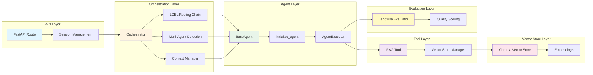

# System Flow Diagram

## Component Interaction Diagram



## Key Decision Points

### 1. Single vs Multi-Agent Routing

**Decision Point**: After receiving a user query, the orchestrator must determine if one or multiple agents are needed.

**Process**:
```
Query → Multi-Agent Detection (LLM) → {
    requires_multiple_agents: true/false
    agents: ["finance", "tech"]
    requires_sequential: true/false
}
```

**Criteria**:
- **Single Agent**: Query clearly belongs to one domain
- **Multi-Agent**: Query spans multiple domains or has multiple independent parts

**Example**:
- Single: "How do I update my payment method?" → `finance`
- Multi: "I need to update payment and also want API docs" → `["finance", "tech"]`

---

### 2. Parallel vs Sequential Processing

**Decision Point**: For multi-agent queries, determine if agents can process independently or need context handoff.

**Process**:
```
Multi-Agent Query → LLM Analysis → {
    requires_sequential: true/false
    reasoning: "Finance needs HR's answer first"
}
```

**Criteria**:
- **Parallel**: Agents can work independently
  - Example: "Update payment method and get API docs" (independent)
- **Sequential**: One agent's output is needed by another
  - Example: "Can I upgrade? If yes, what's the pricing?" (finance needs hr's answer)

**Implementation**:
- **Parallel**: `asyncio.gather()` - all agents process simultaneously
- **Sequential**: Loop through agents, adding each response to context for next agent

---

### 3. RAG Tool Usage

**Decision Point**: Agent must decide when to use RAG tool vs. answering from general knowledge.

**Process**:
```
Agent receives query → AgentExecutor decides → {
    Use RAG Tool: If domain-specific knowledge needed
    Direct Answer: If general knowledge sufficient
}
```

**Criteria**:
- **Use RAG**: Query requires specific handbook information
- **Skip RAG**: Query is general conversation or clarification

**Implementation**: LangChain's `initialize_agent` automatically decides based on tool descriptions and query content.

---

### 4. Similarity Filtering

**Decision Point**: After retrieving chunks from vector store, filter by relevance threshold.

**Process**:
```
Retrieve k*2 chunks → Convert distance to similarity → Filter by min_similarity → Deduplicate → Return k chunks
```

**Criteria**:
- **Include**: `similarity >= min_similarity` (default: 0.78)
- **Exclude**: Below threshold or duplicate content

**Impact**:
- Higher threshold (0.85+): More precise but fewer results
- Lower threshold (0.70-): More results but potentially less relevant

---

### 5. Response Bundling Strategy

**Decision Point**: How to combine multiple agent responses into a coherent answer.

**Process**:
```
Multiple Agent Responses → Bundle Strategy → Final Response
```

**Strategies**:
- **Single Agent**: Return response directly
- **Multi-Agent Parallel**: Combine with agent labels `[FINANCE]\n...\n\n[TECH]\n...`
- **Multi-Agent Sequential**: Bundle maintaining dependency chain

**Example**:
```
Sequential Query: "Can I upgrade? If yes, pricing?"
→ [HR] Yes, you can upgrade to Enterprise plan
→ [FINANCE] Enterprise plan pricing: $X/month...
```

---

### 6. Quality Evaluation

**Decision Point**: Automatically evaluate response quality using LLM-as-a-Judge.

**Process**:
```
Response Generated → Langfuse Evaluator → LLM Evaluation → Quality Score (1-10)
```

**Dimensions**:
- Relevance (30%)
- Accuracy (25%)
- Completeness (20%)
- Clarity (15%)
- Helpfulness (10%)

**Threshold**: Score ≥ 7.0 considered acceptable

---

### 7. Error Handling

**Decision Point**: How to handle errors at different levels of the system.

**Process**:
```
Error Occurs → Error Type Detection → Handling Strategy
```

**Strategies**:
- **Agent Error**: Return error response, continue with other agents
- **Orchestrator Error**: Fallback to `general_knowledge` agent
- **No Context Found**: Return helpful message, don't treat as error
- **Critical Error**: Return generic error message to user

**Implementation**: Try-except blocks at each layer with appropriate fallbacks.

