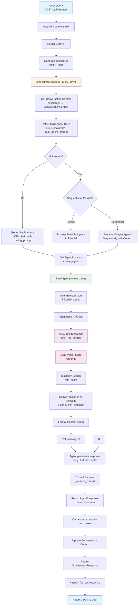
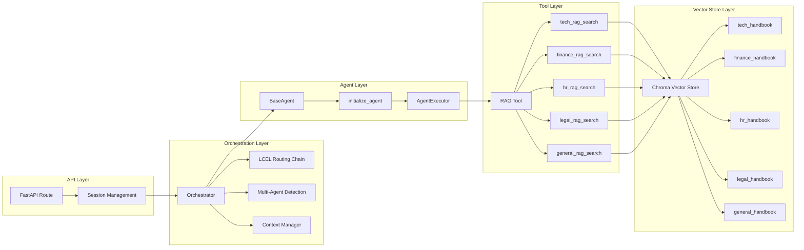
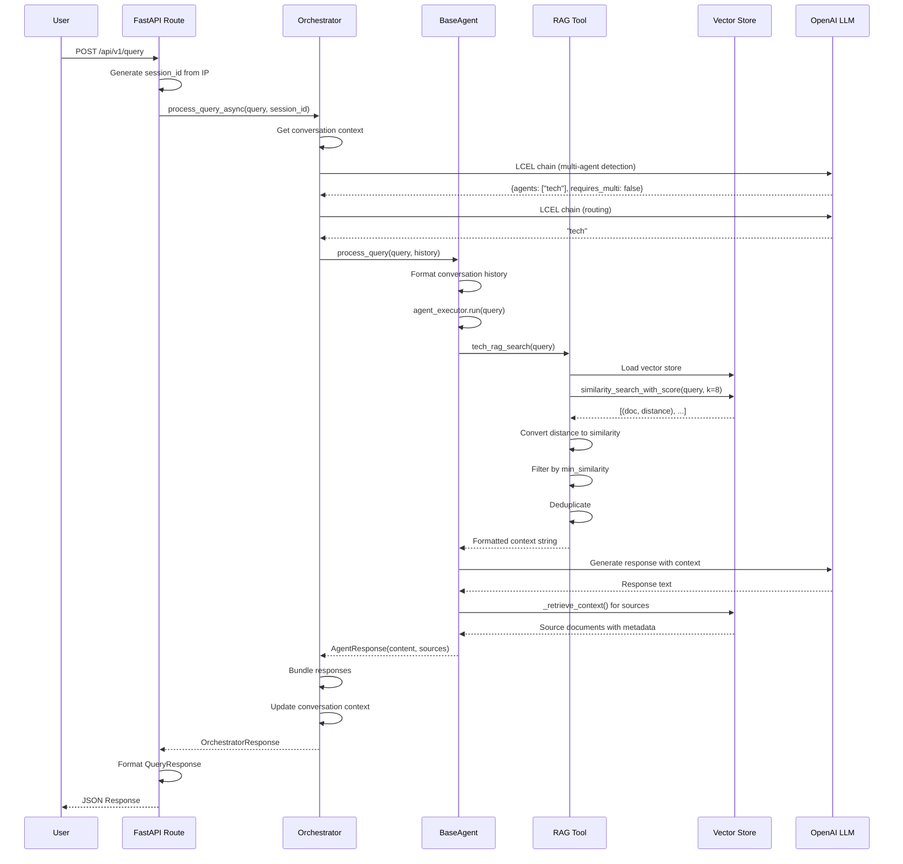
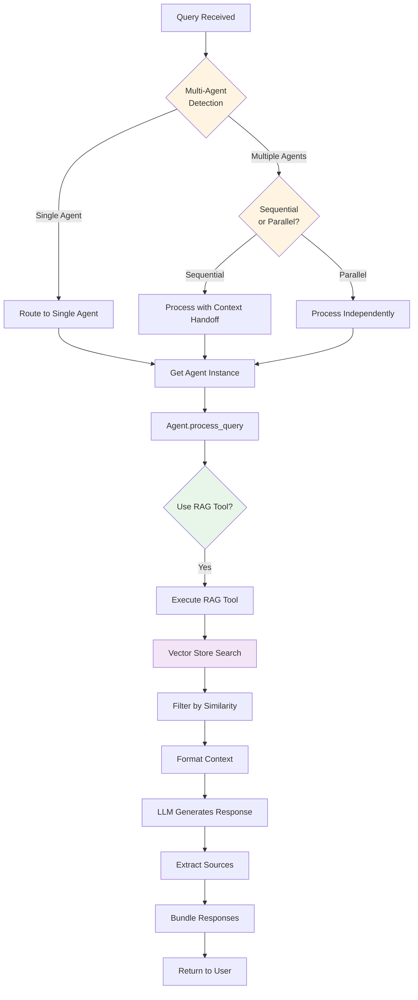

# System Flow Diagram (Mermaid)

## Complete System Flow



## Component Interaction Diagram



## Data Flow Sequence



## Key Decision Points



## Technology Stack Flow

```
┌─────────────────────────────────────────────────────────────┐
│                    USER INTERFACE                            │
│              HTTP POST Request                               │
└───────────────────────┬─────────────────────────────────────┘
                        │
        ┌───────────────┴───────────────┐
        │                               │
┌───────▼────────┐            ┌────────▼────────┐
│   FastAPI      │            │   Langfuse       │
│   (Web Server) │            │   (Observability)│
└───────┬────────┘            └─────────────────┘
        │
┌───────▼──────────────────────────────────────┐
│           ORCHESTRATOR                         │
│  • LCEL Chain (Routing)                       │
│  • LCEL Chain (Multi-Agent Detection)         │
│  • Context Management                         │
└───────┬───────────────────────────────────────┘
        │
┌───────▼──────────────────────────────────────┐
│           BASE AGENT                           │
│  • initialize_agent (LangChain)               │
│  • AgentExecutor                               │
└───────┬───────────────────────────────────────┘
        │
┌───────▼──────────────────────────────────────┐
│           RAG TOOLS                            │
│  • Tool (LangChain)                           │
│  • Vector Store Access                        │
└───────┬───────────────────────────────────────┘
        │
┌───────▼──────────────────────────────────────┐
│           VECTOR STORE                         │
│  • Chroma                                     │
│  • OpenAI Embeddings                         │
│  • Cosine Similarity                         │
└──────────────────────────────────────────────┘
```

