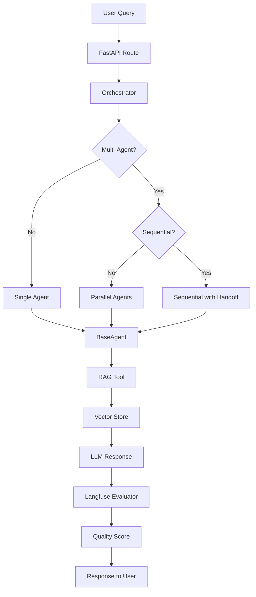
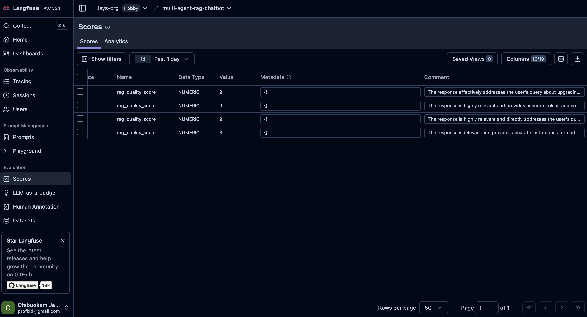
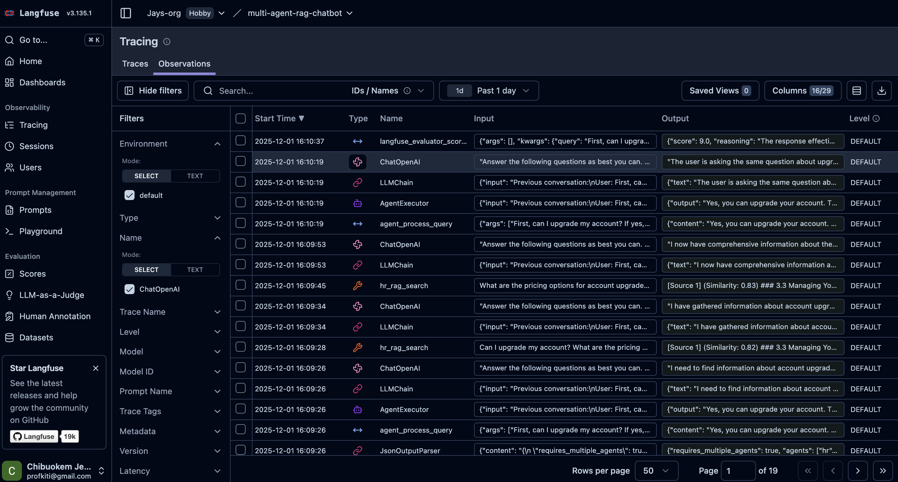

# Multi-Agent RAG Chatbot - Technical Report

## Executive Summary

This report documents the architecture, design decisions, and implementation of a sophisticated **Multi-Agent RAG (Retrieval Augmented Generation) Chatbot** system for JupiterIQ. The system intelligently routes customer inquiries across specialized AI agents (Finance, HR, Legal, Tech, and General Knowledge), each equipped with domain-specific knowledge bases and RAG capabilities.

**Key Highlights:**
- 🎯 **Intelligent Multi-Agent Orchestration** with automatic parallel/sequential processing
- 🔄 **Context-Aware Conversations** with seamless agent handoffs
- 📊 **Automatic Quality Evaluation** using Langfuse LLM-as-a-Judge
- 🧪 **Comprehensive Testing** with golden dataset validation
- 🚀 **Production-Ready** with preloaded vector stores and optimized performance

---

## Table of Contents

1. [System Architecture](#system-architecture)
2. [Core Components](#core-components)
3. [Orchestrator Deep Dive](#orchestrator-deep-dive)
4. [RAG Implementation](#rag-implementation)
5. [Langfuse Evaluation System](#langfuse-evaluation-system)
6. [Testing & Quality Assurance](#testing--quality-assurance)
7. [Performance Optimizations](#performance-optimizations)
8. [Technology Stack](#technology-stack)

---

## System Architecture

### High-Level Overview

```
┌─────────────────────────────────────────────────────────────────┐
│                         USER QUERY                               │
│                    POST /api/v1/query                           │
└────────────────────────────┬────────────────────────────────────┘
                             │
                             ▼
┌─────────────────────────────────────────────────────────────────┐
│                    FastAPI Application                          │
│  • Session Management (IP-based)                                │
│  • Request Routing                                               │
└────────────────────────────┬────────────────────────────────────┘
                             │
                             ▼
┌─────────────────────────────────────────────────────────────────┐
│                    ORCHESTRATOR                                  │
│  • Multi-Agent Detection (LLM-powered)                          │
│  • Intelligent Routing                                           │
│  • Context Management                                            │
│  • Response Bundling                                             │
└────────────────────────────┬────────────────────────────────────┘
                             │
                ┌────────────┴────────────┐
                │                         │
        ┌───────▼────────┐       ┌────────▼────────┐
        │  SINGLE AGENT  │       │  MULTI-AGENT   │
        │   Processing   │       │   Processing   │
        └───────┬────────┘       └────────┬────────┘
                │                         │
                │              ┌──────────┴──────────┐
                │              │                     │
        ┌───────▼────────┐  ┌──▼──────┐      ┌──────▼──────┐
        │  Specialist    │  │Parallel │      │ Sequential  │
        │    Agent       │  │Processing│     │Processing   │
        └───────┬────────┘  └──────────┘      └─────────────┘
                │
                ▼
┌─────────────────────────────────────────────────────────────────┐
│                    BASE AGENT (LCEL Chain)                      │
│  • Always calls RAG tool first                                  │
│  • Deterministic tool usage                                     │
│  • Prompt-based response formatting                             │
└────────────────────────────┬────────────────────────────────────┘
                             │
                             ▼
┌─────────────────────────────────────────────────────────────────┐
│                    RAG TOOL                                     │
│  • Vector Store Search (Chroma)                                 │
│  • Similarity Filtering                                         │
│  • Context Formatting                                           │
└────────────────────────────┬────────────────────────────────────┘
                             │
                             ▼
┌─────────────────────────────────────────────────────────────────┐
│              LANGFUSE EVALUATOR                                 │
│  • Automatic Quality Scoring (1-10)                              │
│  • LLM-as-a-Judge                                               │
│  • Score Storage in Langfuse                                   │
└─────────────────────────────────────────────────────────────────┘
```

### Component Interaction Flow



---

## Core Components

### 1. **Orchestrator** (`src/querying/agents/orchestrator.py`)

The orchestrator is the brain of the system, responsible for:
- **Intelligent Routing**: Determines which agent(s) should handle a query
- **Multi-Agent Coordination**: Manages parallel and sequential processing
- **Context Management**: Maintains conversation continuity across sessions
- **Response Bundling**: Combines multiple agent responses coherently

### 2. **Specialist Agents** (`src/querying/agents/base_agent.py`)

Each specialist agent:
- Uses **LangChain Expression Language (LCEL)** chains for deterministic tool usage
- **Always calls RAG tool first** before generating responses
- Has access to its own **domain-specific vector store**
- Formats responses based on retrieved context
- Returns responses with source citations

### 3. **RAG Tools** (`src/querying/tools/rag_tool.py`)

Modular RAG functionality:
- **LangChain Tool** interface for agent integration
- **Similarity search** with configurable thresholds
- **Deduplication** to prevent duplicate chunks
- **Context formatting** for LLM consumption

### 4. **Vector Store Manager** (`src/querying/tools/vector_store_manager.py`)

Performance optimization:
- **Preloads all vector stores** at server startup
- **Eliminates query-time loading delays**
- **Caches stores** for fast access

### 5. **Langfuse Evaluator** (`src/evaluation/langfuse_evaluator.py`)

Automatic quality assessment:
- **LLM-as-a-Judge** evaluation
- **1-10 quality scoring** with reasoning
- **Multi-dimensional analysis** (relevance, accuracy, completeness, clarity, helpfulness)
- **Automatic score storage** in Langfuse

---

## Orchestrator Deep Dive

The orchestrator is the most sophisticated component, implementing several advanced patterns:

### 1. **Intelligent Multi-Agent Detection**

The orchestrator uses an LLM to analyze queries and determine:
- Whether multiple agents are needed
- Whether agents should process **in parallel** (independent) or **sequentially** (with dependencies)

**Example:**
```python
# Query: "First, can I upgrade my account? If yes, what are the pricing options?"
# Detection Result:
{
    "requires_multiple_agents": true,
    "agents": ["hr", "finance"],
    "requires_sequential": true,  # Finance needs HR's answer first
    "reasoning": "Finance agent needs to know if upgrade is possible before providing pricing"
}
```

### 2. **Context Handoff Strategy**

For sequential multi-agent processing, the orchestrator implements a sophisticated handoff mechanism:

```python
# Sequential Processing Flow:
1. Agent 1 processes query → generates response
2. Response added to conversation history with agent label
3. Agent 2 receives: original query + Agent 1's response
4. Agent 2 can reference Agent 1's findings
5. Responses bundled into coherent final answer
```

**Key Features:**
- **Agent-labeled responses** in history: `"[HR Agent]: Yes, you can upgrade..."`
- **Context preservation** across agent boundaries
- **Natural conversation flow** maintained

### 3. **Context Bundling**

The orchestrator intelligently combines multiple agent responses:

**Single Agent:**
- Returns agent response directly

**Multi-Agent (Parallel):**
- Combines independent responses with clear agent labels
- Example: `[FINANCE]\n...\n\n[TECH]\n...`

**Multi-Agent (Sequential):**
- Bundles responses maintaining dependency chain
- Preserves context flow from first to last agent

### 4. **Conversation Context Management**

Each session maintains:
- **Message History**: Last 20 messages for context
- **Agent History**: Which agents handled previous queries
- **Last Agent**: For context continuity

**Session Management:**
- **Automatic session_id generation** from client IP (hashed for privacy)
- **Per-session isolation** ensures conversations don't mix
- **Context-aware routing** based on conversation history

### 5. **Error Handling & Fallback**

Robust error handling at multiple levels:
- **Agent-level errors**: Caught and returned as error responses
- **Orchestrator fallback**: Falls back to `general_knowledge` agent on critical errors
- **Graceful degradation**: System continues operating even if one agent fails

---

## RAG Implementation

### Vector Store Architecture

**Per-Agent Vector Stores:**
- Each agent has its own **Chroma vector store**
- Stores: `data/vectorstore/{handbook_name}/`
- **Preloaded at startup** for performance

**Embedding Model:**
- **OpenAI `text-embedding-3-small`**
- Supports **OpenRouter** via `OPENAI_API_BASE`
- Consistent embeddings across indexing and querying

### Intelligent Chunking

**Header-Based Splitting:**
- Primary strategy: Split on Markdown headers (`#`, `##`, `###`)
- Preserves document structure and context

**Fallback Strategy:**
- Recursive character splitting if headers unavailable
- Configurable chunk size (1000) and overlap (200)

### Similarity Search & Filtering

**Cosine Similarity:**
- Chroma returns **cosine distance** (0 = identical, 2 = opposite)
- **Conversion**: `similarity = 1 - distance`
- **Filtering**: Only chunks with `similarity >= min_similarity` (default: 0.78)

**Deduplication:**
- Prevents duplicate chunks in results
- Normalizes content for comparison
- Retrieves `k * 2` documents, filters and deduplicates to `k` unique results

---

## Langfuse Evaluation System

### Automatic Quality Scoring

Every response is automatically evaluated using **LLM-as-a-Judge**:

**Evaluation Dimensions:**
1. **Relevance** (30%): Does it address the query?
2. **Accuracy** (25%): Is it factually correct?
3. **Completeness** (20%): Does it fully answer?
4. **Clarity** (15%): Is it clear and well-structured?
5. **Helpfulness** (10%): Is it actionable?

**Scoring:**
- **Scale**: 1-10 (10 = excellent)
- **Pass Threshold**: 7.0
- **Automatic Storage**: Scores stored in Langfuse and linked to traces

### Langfuse Scores Dashboard

The Langfuse Scores dashboard provides a centralized view of all quality evaluations, allowing you to monitor, filter, and analyze response quality over time.



*Figure: Langfuse Scores dashboard showing `rag_quality_score` evaluations with values of 9, 9, and 8. Each score includes detailed comments explaining the quality assessment, enabling easy identification of high-performing responses and areas for improvement.*

**Key Features:**
- **Score Filtering**: Filter by score name (`rag_quality_score`), value range, date range, and metadata
- **Score Details**: View individual scores with associated comments and reasoning
- **Analytics**: Track score distributions and trends over time
- **Source Tracking**: Identify which API calls generated each score
- **Metadata Support**: Attach custom metadata to scores for advanced filtering

### Integration

```python
# In orchestrator.py - Automatic evaluation after response generation
quality_score = self.evaluator.evaluate_response(
    query=query,
    response=bundled_content,
)
# Score automatically stored in Langfuse via @observe decorator
```

**Benefits:**
- ✅ **Zero manual work** - fully automated
- ✅ **Continuous monitoring** - every response scored
- ✅ **Quality trends** - track performance over time
- ✅ **Issue detection** - identify low-quality responses automatically
- ✅ **Centralized Dashboard** - view all scores in one place with filtering and analytics

---

## Testing & Quality Assurance

### Golden Dataset Testing

**Test Structure:**
- JSONL format with test cases
- Each test case includes:
  - Query
  - Expected agent(s)
  - Expected routing mode
  - Expected sources
  - Expected keywords

**Test Runner:**
```bash
# Run all tests
python tests/test_runner.py

# Run specific dataset
python tests/test_runner.py --dataset finance.jsonl

# Run with limits
python tests/test_runner.py --dataset finance.jsonl --max-tests 5
```

**Test Results:**
- Quality scores from Langfuse evaluator
- Pass/fail based on score threshold (≥7.0)
- Detailed reasoning for each score

### Test Coverage

**Datasets:**
- `finance.jsonl` - Finance agent test cases
- `hr.jsonl` - HR agent test cases
- `legal.jsonl` - Legal agent test cases
- `tech.jsonl` - Tech agent test cases
- `general_knowledge.jsonl` - General knowledge test cases
- `multi_agent.jsonl` - Multi-agent routing tests
- `routing.jsonl` - Routing accuracy tests

---

## Performance Optimizations

### 1. **Vector Store Preloading**

**Problem**: Loading vector stores at query time causes 1-2 second delays

**Solution**: Preload all vector stores at server startup

```python
# In orchestrator.__init__()
self.vector_store_manager = VectorStoreManager(handbook_names)
# All 5 vector stores loaded immediately
```

**Impact**: First query is as fast as subsequent queries

### 2. **Agent Instance Caching**

**Lazy Loading**: Agents created on first use, then cached

**Benefit**: Avoids repeated initialization overhead

### 3. **Conversation Context Limits**

**Message History**: Limited to last 20 messages

**Benefit**: Prevents context bloat and maintains performance

### 4. **Deduplication**

**Retrieval Strategy**: Retrieve `k * 2`, filter and deduplicate to `k`

**Benefit**: Ensures unique, high-quality results

---

## Technology Stack

### Core Frameworks

- **FastAPI**: Modern, fast web framework for API
- **LangChain**: LLM orchestration and RAG framework
- **Chroma**: Vector database for embeddings
- **OpenAI**: Embeddings and LLM models
- **Langfuse**: Observability and evaluation platform

### Key LangChain Components

- **`LCEL`**: LangChain Expression Language for chains (used for deterministic RAG flow)
- **`Tool`**: Modular RAG functionality
- **`ChatPromptTemplate`**: Structured prompt management
- **`CallbackHandler`**: Langfuse integration
- **`StrOutputParser`**: Response parsing

### Architecture Patterns

- **Multi-Agent System**: Specialized agents with domain expertise
- **RAG (Retrieval Augmented Generation)**: Context-aware responses
- **LLM-as-a-Judge**: Automated quality evaluation
- **Session Management**: Context-aware conversations
- **Modular Design**: Clean separation of concerns

---

## Key Design Decisions

### 1. **Why Multi-Agent Architecture?**

**Benefit**: Each agent specializes in its domain, leading to:
- More accurate responses
- Better source retrieval
- Clearer responsibility boundaries

### 2. **Why Preload Vector Stores?**

**Benefit**: Eliminates cold-start delays, ensuring consistent response times

### 3. **Why Langfuse Evaluator?**

**Benefit**: Automatic quality monitoring without manual annotation

### 4. **Why LCEL over LLMChain?**

**Benefit**: Modern, non-deprecated approach with better performance

### 5. **Why Per-Agent Vector Stores?**

**Benefit**: 
- Isolation prevents cross-contamination
- Independent scaling
- Clearer source attribution

---

## System Flow Example

### Example 1: Single Agent Query

```
User: "How do I update my payment method?"

1. FastAPI extracts IP → generates session_id
2. Orchestrator detects: single agent needed
3. Routing LLM: "finance"
4. FinanceAgent processes query
5. RAG tool searches finance_handbook
6. LLM generates response with context
7. Langfuse evaluator scores: 9.0/10
8. Response returned with quality score
```

### Example 2: Multi-Agent Sequential Query

```
User: "First, can I upgrade my account? If yes, what are the pricing options?"

1. Orchestrator detects: multi-agent, sequential
2. HR Agent processes: "Can I upgrade?"
   → Response: "Yes, you can upgrade to Enterprise plan"
3. Response added to context: "[HR Agent]: Yes, you can upgrade..."
4. Finance Agent processes with context:
   → Query: "First, can I upgrade... If yes, what are the pricing?"
   → Context: "[HR Agent]: Yes, you can upgrade..."
   → Response: "Enterprise plan pricing: $X/month..."
5. Responses bundled: "[HR]\n...\n\n[FINANCE]\n..."
6. Langfuse evaluator scores: 8.5/10
7. Final response returned
```

### Example 3: Multi-Agent Parallel Query

```
User: "I need to update my payment method and also want to know about your API authentication"

1. Orchestrator detects: multi-agent, parallel
2. Finance Agent and Tech Agent process simultaneously
3. Both responses generated independently
4. Responses bundled: "[FINANCE]\n...\n\n[TECH]\n..."
5. Langfuse evaluator scores: 8.0/10
6. Final response returned
```

---

## API Endpoints

### Query Endpoint

```http
POST /api/v1/query
Content-Type: application/json

{
  "query": "How do I update my payment method?",
  "min_similarity": 0.78
}
```

**Response:**
```json
{
  "content": "To update your payment method...",
  "agents_used": ["finance"],
  "routing_mode": "single",
  "quality_score": 9.0,
  "quality_reasoning": "The response directly addresses...",
  "sources": [...],
  "session_id": "ip_a1b2c3d4e5f6g7h8"
}
```

### Other Endpoints

- `GET /api/v1/agents` - List available agents
- `GET /api/v1/sessions/{session_id}/history` - Get conversation history
- `DELETE /api/v1/sessions/{session_id}` - Clear session

---

## Running Tests

### Golden Dataset Tests

```bash
# Run all tests
python tests/test_runner.py

# Run specific dataset
python tests/test_runner.py --dataset finance.jsonl

# Run with custom settings
python tests/test_runner.py \
  --dataset finance.jsonl \
  --max-tests 10 \
  --min-similarity 0.75
```

**Output:**
- Quality scores for each test
- Pass/fail status (score ≥ 7.0)
- Overall statistics

---

## Monitoring & Observability

### Langfuse Dashboard

The Langfuse dashboard provides comprehensive observability into every aspect of the system's operation. Every query is automatically traced, showing the complete execution flow from routing to response generation.


*Figure: Langfuse tracing dashboard showing a complete trace for `orchestrator_process_query` with quality score of 9.00. The trace displays the hierarchical execution flow, input/output details, and automatic quality evaluation.*

**Key Features:**

**Traces:**
- Every query creates a detailed trace
- Shows full execution path with hierarchical breakdown
- Includes agent decisions, routing logic, and tool usage
- Timeline view shows execution duration for each step

**Example Trace Breakdown:**
- `orchestrator_process_query` (12.14s)
  - `orchestrator_detect_multi_agent` (2.61s)
    - `RunnableSequence` → `ChatPromptTemplate` → `ChatOpenAI` → `JsonOutputParser`
  - `agent_process_query` (6.12s)
    - RAG Tool execution → `LCEL Chain` → `ChatPromptTemplate` → `ChatOpenAI` → `StrOutputParser`

**Scores:**
- Quality scores automatically linked to traces
- Filter by `rag_quality_score` to find high/low quality responses
- Analyze trends over time to identify patterns
- Each score includes detailed reasoning from the LLM evaluator

**Trace Details:**
- **Input**: Query, session_id, min_similarity threshold
- **Output**: Response content, agents used, routing mode, sources
- **Metadata**: Quality score, reasoning, conversation length, processing mode
- **Token Usage**: Track LLM token consumption per operation
- **Latency**: Performance metrics for each step

### Observations View

The Observations view provides a granular, step-by-step breakdown of every component execution within a trace, showing the complete execution flow from orchestrator to agent to RAG tools.



*Figure: Langfuse Observations dashboard showing detailed execution steps including `langfuse_evaluator_score_response` with quality scores (9.0), RAG tool calls, `ChatOpenAI` LLM invocations, and LCEL chain operations. Each observation shows input/output data, timestamps, and component types.*

**Key Observations Shown:**
- **Evaluator Execution**: `langfuse_evaluator_score_response` entries showing automatic quality scoring (e.g., score: 9.0) with reasoning
- **RAG Tool Calls**: Tool executions like `finance_rag_search` with similarity scores and retrieved context
- **LCEL Chain Operations**: Chain executions showing prompt inputs and generated outputs
- **LLM Invocations**: `ChatOpenAI` observations showing prompt inputs and generated outputs
- **Orchestrator Steps**: `orchestrator_detect_multi_agent` and `orchestrator_process_query` showing routing decisions
- **Component Types**: Visual icons distinguish between tools, chains, LLMs, and custom spans

**Filtering & Analysis:**
- Filter by component type (ChatOpenAI, Tool, RunnableSequence, etc.)
- Filter by name, trace name, level, model, and metadata
- Search across all observations
- View input/output for each step to understand data flow

**Metrics:**
- Response times across different agents
- Agent usage patterns and routing decisions
- Quality score distributions
- Token usage and cost tracking
- Component-level performance analysis

---

## Future Enhancements

### Potential Improvements

1. **Agent Memory**: Long-term memory for user preferences
2. **Confidence Scores**: Agent confidence in responses
3. **Human-in-the-Loop**: Escalation for low-quality responses
4. **A/B Testing**: Compare different routing strategies
5. **Custom Evaluators**: Domain-specific evaluation criteria

---

## Conclusion

This multi-agent RAG chatbot system demonstrates:

✅ **Sophisticated Architecture**: Intelligent routing and multi-agent coordination  
✅ **Production-Ready**: Optimized performance with preloaded stores  
✅ **Quality Assurance**: Automatic evaluation and comprehensive testing  
✅ **Observability**: Full tracing and monitoring with Langfuse  
✅ **Modularity**: Clean, maintainable code structure  
✅ **Scalability**: Easy to add new agents or modify existing ones  

The system successfully handles complex customer inquiries across multiple domains while maintaining conversation context and ensuring high-quality responses through automated evaluation.

---

## References

- **Flow Diagrams**: See `FLOW_DIAGRAM.md` for component interaction diagram and key decision points
- **Langfuse Evaluator**: See `src/evaluation/LANGFUSE_EVALUATOR.md`
- **Golden Datasets**: See `data/golden_datasets/README.md`
- **API Documentation**: Available at `/docs` when server is running

